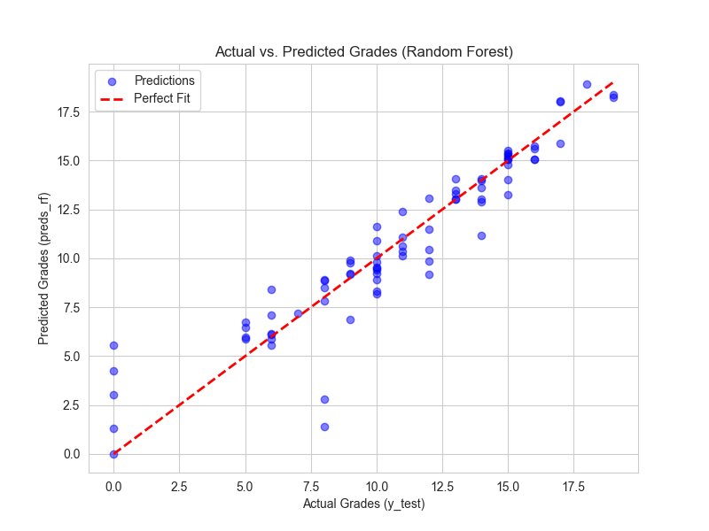
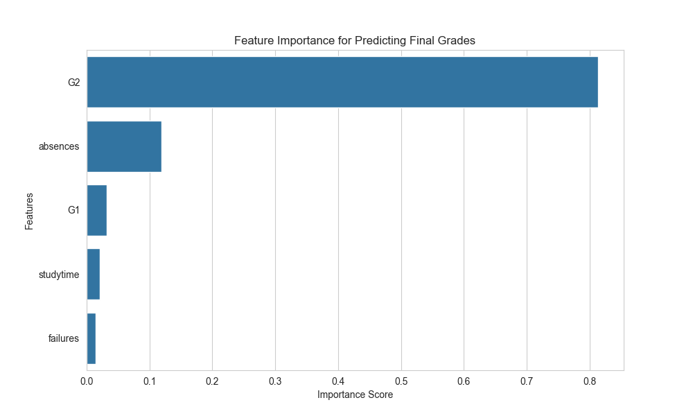
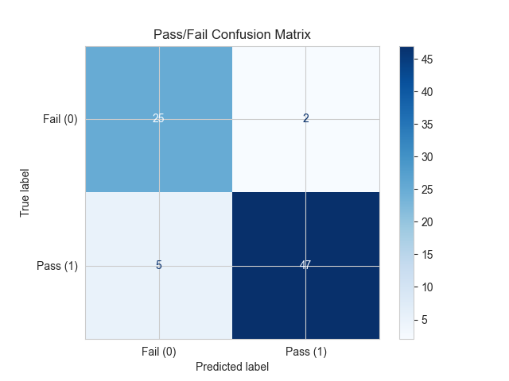

# Student Grade Prediction System

A machine learning project to forecast student academic performance based on historical data. This project uses supervised learning techniques to build both regression and classification models in Python.

## 📋 Project Description
The goal of this project is to predict a student's final grade (**G3**) based on their prior grades (`G1`, `G2`), study habits, and demographic data. I built two types of models:

1.  **Regression Model:** Predicts the exact final grade (a score from 0-20).
2.  **Classification Model:** Predicts whether the student will "Pass" (>= 10) or "Fail" (< 10).

## 🛠️ Technologies Used
* **Python**
* **scikit-learn:** For building and evaluating all machine learning models.
* **Pandas:** For loading and manipulating the data.
* **NumPy:** For numerical operations.
* **Matplotlib & Seaborn:** For data visualization.
* **Jupyter Notebook:** As the development environment.

## 📊 Key Findings

### 1. Feature Importance
As expected, a student's prior grades (`G1` and `G2`) are by far the most significant predictors of their final grade. `failures` and `absences` also have a notable impact.

### 2. Model Performance (Regression)
I compared a simple `LinearRegression` model with a more complex `RandomForestRegressor`. The Random Forest model achieved a higher R-squared value, indicating it provides a more accurate prediction.

* **Random Forest R-squared:** `[0.8714]`
* **Linear Regression R-squared:** `[0.7822]`

### 3. Model Performance (Classification)
I also trained a `RandomForestClassifier` to predict a simple Pass/Fail outcome. The model achieved a high level of accuracy.

* **Classification Accuracy:** `[91.14%]`

This confusion matrix shows the model's performance, with very few incorrect predictions (top-right and bottom-left boxes).

## 🚀 How to Run
1.  Clone this repository.
2.  Install the required libraries: `pip install pandas numpy matplotlib seaborn scikit-learn jupyterlab`
3.  Run the `Student-Grade-Prediction.ipynb` notebook in Jupyter.
